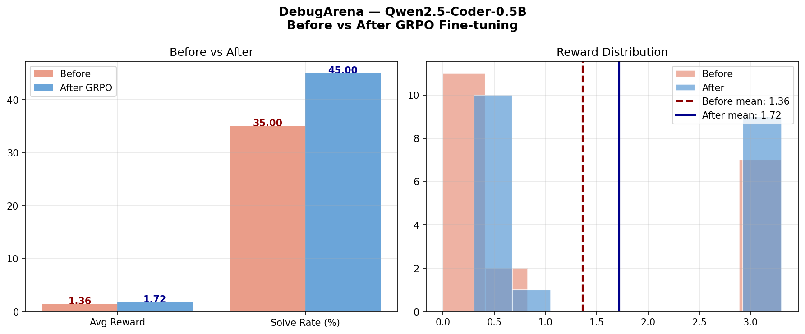

# 🐛 DebugArena

### An RL Environment for Teaching LLMs to Fix Buggy Code

**Meta PyTorch OpenEnv Hackathon × Scaler School of Technology 2026**
**Theme 4: Self-Improving Agents** | Solo Participant: Bharath Vikas Tadepalli

---

## Results



| Metric | Before Training | After GRPO | Change |
|--------|----------------|------------|--------|
| Avg Reward | 1.361 | 1.717 | +26% |
| Solve Rate | 35% | 45% | +10pp |

**Model:** Qwen2.5-Coder-0.5B-Instruct (from HuggingFace)
**Training:** GRPO via TRL + Unsloth on T4 GPU

---

## What is DebugArena?

DebugArena is a reinforcement learning training environment where an LLM agent
learns to fix buggy Python code purely through trial and error.

The agent receives a broken function, proposes a fix, and gets rewarded based
on how many unit tests pass. No correct answers are ever shown. The agent
figures out fixes from error messages and test failures alone.

### Why this matters

Today's LLMs are good at writing code but weak at debugging existing broken
code. This is because there is almost no training data of the form:

```
broken code → error message → minimal fix
```

DebugArena generates this training signal infinitely and automatically,
for any LLM you plug into it.

---

## How it works

```
Agent receives buggy function
         ↓
Sees error message + failing tests
         ↓
Proposes a fix
         ↓
Environment runs fix in sandboxed executor
         ↓
Reward computed from 4 independent signals
         ↓
Agent tries again (max 5 attempts)
         ↓
Repeat 200 episodes → model improves
```

---

## Reward Design (4 Independent Signals)

Following the hackathon guide's recommendation to prevent reward hacking:

| Signal | Value | Description |
|--------|-------|-------------|
| Tests passing | 0.0 – 1.0 | Proportion of unit tests that pass |
| Full solve bonus | +2.0 | All tests pass |
| Format compliance | +0.2 / -0.3 | Valid function vs malformed code |
| Anti-hacking | +0.1 / -1.0 | Clean code vs forbidden imports |

### Anti-Reward-Hacking
- Forbidden imports blocked: `os`, `sys`, `subprocess`, `socket`
- Restricted builtins — no `eval`, `exec`, `__globals__`
- Each test runs independently
- RecursionError caught and penalised

---

## Bug Curriculum

42 hand-crafted bugs across 3 difficulty levels:

| Difficulty | Count | Examples |
|------------|-------|---------|
| Easy | 14 | Wrong operators, off-by-one, reversed conditions |
| Medium | 16 | Type errors, missing edge cases, None handling |
| Hard | 12 | Algorithm bugs, recursion, data structures |

---

## Training Setup

```python
from trl import GRPOConfig, GRPOTrainer
from unsloth import FastLanguageModel

model, tokenizer = FastLanguageModel.from_pretrained(
    model_name='unsloth/qwen2.5-coder-0.5b-instruct',
    max_seq_length=2048,
    load_in_4bit=True,
)

trainer = GRPOTrainer(
    model=model,
    reward_funcs=compute_reward,  # calls DebugArena environment
    args=GRPOConfig(
        num_train_epochs=3,
        num_generations=4,
        learning_rate=1e-5,
    ),
    train_dataset=dataset,
)
trainer.train()
```

---

## Quick Start

```bash
pip install openenv-core fastapi uvicorn httpx
```

```python
import httpx

# Start server first: uvicorn server.app:app --port 8000

client = httpx.Client(base_url='http://localhost:8000')

# Get a bug
obs = client.post('/reset', json={}).json()['observation']
print(obs['buggy_code'])
print(obs['test_results'])

# Submit a fix
result = client.post('/step', json={
    'fixed_code': 'def add(a, b):\n    return a + b',
    'explanation': 'fixed operator'
}).json()
print(f"Reward: {result['reward']}")
print(f"Solved: {result['observation']['solved']}")
```

---

## File Structure

```
debugarena/
├── models.py          ← Action, Observation, State types
├── bugs.py            ← 42 buggy functions with test cases
├── client.py          ← HTTP client for training loop
├── server/
│   ├── environment.py ← Core RL environment logic
│   └── app.py         ← FastAPI server wrapper
└── DebugArena_FINAL_FIXED.ipynb  ← Training notebook
```

---

## What's Next

1. **Auto-generated bugs** — use an LLM to generate infinite new bugs
2. **Curriculum learning** — easy bugs first, hard bugs after model improves
3. **Multi-language** — JavaScript and Java support
4. **Larger models** — test with 7B+ parameter models

---

## Built With

OpenEnv · TRL · Unsloth · Qwen2.5-Coder · HuggingFace · FastAPI

---

*Solo submission by Bharath Vikas Tadepalli*
*Meta PyTorch OpenEnv Hackathon × Scaler SST 2026*
